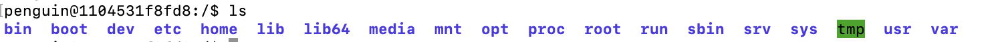

# Linux-Getting-Started

TOC:

1. Basic commands
2. Users
3. Files
4. Bash
5. Networking
6. System
7. List of commands
8. Make a bootble drive


## 1 Basic commands

### 1.1 Basic File & directory commands

- ls
- cd
- pwd
- mkdir
- cp
- rm
- find

### 1.2 File handling commands

- cat
- grep
- which
- echo
- cut
- sort
- type
- stat
- tee

### 1.3 File permission commands

- chmod
- umask
- setfacl
- getfacl

### 1.4 User commands

- uname
- id
- who

### 1.5 System commands

- ps
- top
- kill

**cd** : Change dir

```
cd directory
-> moves to specified directory

cd
-> returns to 'home dir' eg: for user 'penguin' = /home/penguin

cd ..
-> moves one dir UP

cd - 
-> returns to previous working directory
```


**pwd** : Print (actual)working dir = 'where am I now ?'

```
pwd
/home/penguin
```

**mkdir** : Make dir

```
mkdir -p /home/penguin/AWS/BigData/Mobile
-> -p = make all 'parent dirs if they do not exist !
```

**find**

```
find . -type f -name 'test*'                    -> return all files under this dir starting with 'test'
find . -type f -iname 'test*'                   -> idem but 'i' makes it CASE INSENSITIVE !!

find . -type f -name '*.json' -maxdepth 1        -> search only 1 dir deep = 'this dir'
find . -type f -name '*json' -maxdepth 1 -exec rm {} +
                                                -> executes 'rm' on all found files in THIS dir (+=end)


find . -type f mmin -10                         -> find changed files < 10 minutes in this dir.
find . -type f mmin +5 mmin -15                 -> returns chenged file between 5 and 15 min
find . -type f mtime -10                        ->  returns files changed within last 10 days
find . -type f ctime

find / -name "*.json" -print 2>/dev/null        -> find under root('/'), all 'json-files' and blackhole errors (2=stderr) (cfr permission denied)
find / -user penguin -name "Book*" -print 2>/dev/null

find / -size +5M                        -> find files > 5M in root dir (use k=KiloByte and G=Giga)
find / -empty                           -> find all O byte files

find / -perm 777

find myWebsite -exec chown penguin:www-data {} +
                                        -> -exec .. to execute a cmd
                                        -> user=penguin group=www-data
                                        -> {} placholder for find result and + ='end of exec'
find myWebsite -type d -exec chmod 775 {} +
                                        -> sets all dir+subdir permissions to 775
find myWebsite -type f -exec chmod 644 {} +
                                        -> sets all file permissions to 644
!Check it!
find myWebsite -chmod 775
ind myWebsite -chmod 664
```

**grep** Global Regular Expression Print

**umask**

Dicates the default file permission set.

How ?

- umask = 0022 (default)
- permissions = 0666 -umask = 0644 (rx-|r--|r--)

**ps**
bin:            directory
boot:           directory
cdrom:          directory
dev:            directory
etc:            directory
home:           directory
lib:            directory
lib64:          directory
lost+found:     directory
media:          directory
mnt:            directory
opt:            directory
proc:           directory
root:           directory
run:            directory
sbin:           directory
snap:           directory
srv:            directory
sys:            directory
tmp:            sticky, directory
usr:            directory
var:            directory
    ps (with no '-') = BSD syntax
    ps - = Unix/Linux syntax

    Mixing both, BSD and Unix/Linux, can become confusing!

**remark = both are different !!!** eg 'ps aux >< ps -aux'

```
ps              -> shows running **processes** in current shell' (default ps is filtered!)
ps -f           -> show 'full' (details) -including 'Parent PIP = PPID'
ps -l           -> show 'long' (details) -> even more then '-f'
ps -e == ps -A  -> shows 'all' processes or deamon = process with no relation to tty
ps -a           -> shows 'all' processes - -related with tty terminal
ps -u           -> add 'user info'
ps -aux         -> show 'all' (-a) processes for 'user'(-u) and 'user=x(all users)'
ps -aupenguin   -> show 'all' (-a) processes for 'user'(-u) and 'user=penguin'
ps x            -> !BSD notation! = lift the tty restriction
ps a            -> !BSD notation! = lift the 'only yourself restriction
ps u            -> !BSD notation! = full details (u user oriented format)
ps aux          -> !BSD notation! = all processes
ps ax == ps -ef -> (a all process) == (-e every process long_format)
```

**top**

Shows top processes

```
top
```

**kill**

```
kill 1297       -> kills process PID=1297
```

## 2 Users

### 2.1 Password file

- file location = /etc/passwd
- stored in ETSI format = 7 fields


example:


### 2.2 Adding and deleting users

```
useradd penguin -m -s /bin/bash -g users
-> -m = create home dir for this user (/home/penguin)
-> -s = default bash for this user
-> -g = belongs to group
```

How to delete a user?

```
userdel -rf polarbear       -> -r deletes /home/polarbear dir + mail -f = force (even if logged in)
```

**Remark:** you have to have permission in order to create users , usually 'root'.

### 2.3 groups

```
groupadd -g 916 testers         -> adds a group (see /etc/group) with id=916 named 'testers'
```

How to make a user be member of multiple groups? -> edit /etc/group and add all groups (separated with ',')

```
penguin:x:1000:users,testers    -> user 'penguin' now member of 'users' and 'testers
```

### 2.4 sudo

Remark: You have to : 'apt-get install sudo' (sometimes sudo is not installed-> no '/etc/sudoers' file)

If everybody can login as root -> BAD. Because in case of problem there is no way of actually knowing who did it. Solution = give specific users 'root rights' and then they can perform 'sudo ...' under there login account.

```
cat /etc/group          -> lists all the (user)groups
cat /etc/sudoers        -> add user to
passwd penguin          -> as 'root' we can set anybody's password!
```

Config: /etc/sudoers

How to add a user to 'sudo' ?

1. login as 'root'
2. Create user: 'useradd penguin -m -s /bin/bash -g users'
3. Create passwd: 'passwd penguin'
4. Add user to sudoers: 'usermod -aG sudo penguin'
5. test:

   - 'su penguin'
   - 'sudo ls /root' -> if access then ok :-)

## 3 Files

**Everything is a file in linux !**

### 3.1 Filesystem hierarchy



    - '/' = root dir

    - '/root'   = home dir for root user -> ! not in /home
    - '/bin'    = dir for programs
    - '/boot'   = files required for starting your system -> 'DO NOT TOUCH !!'
                  /boot/grub/grub.conf or menu.lst: boot loader
                  /boot/vmlinuz: Linux kernel
    - '/dev'    = contains device files
                    - null  = 'black hole' eg:as stdout for files - /dev/null
                    - tty   = 'teletype' = your terminal window
                    - ttyS0 = serial port (physical device)
                    - pts   = 'pseudo terminal slave' = remote connections eg SSH (no physical device)

                    **remark**
                    - c = 'Character device' -> eg see tty
                    - b = 'block device' = acts as a disk
    - '/etc'    = Everything To Configure -> contains mainly configuration files (eg passwd file, ...)
                  contains also a collection of scripts to start system services at boot time
                  Everything is readable text
                  Interesting files
                    - /etc/crontab: automated jobs
                    - /etc/fstab: a table of storage devices and their mount points
                    - /etc/passwd: user accounts
    - '/home'   = dir for working dir for users. eg: /home/penguin or /home/user2
    - '/lib'    = shared libraries (conf. dll in Windows)
    - '/lib64'  = 64 - bit libraries
    - '/media'  = external plugable media (mainly storage) eg USB drives
    - '/mnt'     = mount = for manualy mounting drives. Today not used very much (? except Docker ?)
    - '/opt'    = for installation of add-on software. Mainly used for commercial software products.
                  read-only and self-contained software. That is, software that does not split their files over bin, lib, 
                  share, include like well-behaved software should.
                    <strong>remark: <\strong> there is a subtile difference between /opt and /usr/local
    - '/proc'   = virtual filesystem maintained by the kernel. The files in this directories are peepholes into the                             
                  kernel. The files are readable and will give you a picture of how the kernel sees the computer
                  created every launch- with info about your computer: CPU, kernel, etc
    - '/root'   = home directory for root user
    - '/run'    = (new dir) where system processes write temp data -> DO NOT TOUCH !!
    - '/sbin'   = dir for 'superuser' programs (eg fdisk)
    - '/tmp'    = temporary files
    - '/usr'    = all system-wide, read-only files installed by (or provided by) the OS
    - '/usr/bin'= executables installed by the Linux distribution. Holds a great number of programs
    - '/usr/lib'= shared libraries for the programs in /usr/bin
    - '/usr/local'= system-wide, read-only files installed by the local administrator (usually, you). And that's why most     
                    directory names from /usr are duplicated here.
    - '/usr/sbin' = system adm programs
    - '/usr/share'= shared data for programs in /usr/bin. eg. conf files, icons, screen backgrounds, sound files
    - '/usr/share/doc' = documentation for programs in /usr/share
    - '~/.local'= the per-user counterpart of /usr/local, that is: software installed by (and for) each user. Like /usr, it 
                    has its own ~/.local/share, ~/.local/bin, ~/.local/lib.
    - '~/.local/opt'= the per-user counterpart of /opt

bin:            directory
boot:           directory
cdrom:          directory
dev:            directory
etc:            directory
home:           directory
lib:            directory
lib64:          directory
lost+found:     directory
media:          directory
mnt:            directory
opt:            directory
proc:           directory
root:           directory
run:            directory
sbin:           directory
snap:           directory
srv:            directory
sys:            directory
tmp:            sticky, directory
usr:            directory
var:            directoryy days'. Now mish-mash of directory with: apps,libs,docs,wallpaper,icons, etc
    - '/srv'    = dir for servers. eg: /srv/www (with html for your site) or /srv/ftp
    - '/sys'    = virtual dir - contains info about connected devices -> DO NOT TOUCH !!
    - '/tmp'    = tempory dir mainly used by runnings applications
    - '/var'    = mainly used for log files

**Remark : ** - '~' = short for home dir, for user 'penguin' this is: /home/penguin


### 3.2 File security

    - first char = file type
    - permission Classes (user, group, Other users)
        - read / write / execute (r/w/x)
        - ther is a subtile difference between 'Other' and 'All -> see Chmod 3.4
    ```
                |  r w x | r w x | r w x
    file type   |  user  | group | Other
        x       |  x x x | x x x | x x x
    ```

example:


```
                |  r w x | r w x | r w x
    file type   |  user  | group | Other
        -       |  1 1 0 | 1 0 0 | 1 0 0
        -       |    6   |   4   |   4    == chmod 644 == user can read/write and rest can read
```

**remark:** | 1 1 1 | == 7 => chmod 777 set read/write/execute for user/group/all = max privilage <br> Also called: **symbolic notation** versus **numeric notation**


**first char**

```
* - : regular file
* d : directory
* l : symbilic link
* c : device file of type character (see /dev/tty)
* b : device file of type block (see /dev/sd)
* s : socket
* p : pipe
* D : Door (only on Solaris)
```

### 3.3 Links

2 types:

- 'ln' hardlinks -> They share **Inode** number (? disk-file partition)
- 'ln -s' symbolic links -> They ** DO NOT** share Inode numbers (have different Inode nr)

**Remarks :**

Sharing or not sharing same Inode has major consequences: rem: 'ls -i' gives Inode number

**HardLinks**

- links are 'pointers' to the same Inode
  - file type = '-'
  - Thus if file to which the link refered is deleted -> link stays intact because Inode nr stiil exists
  - if Chmod on file -> this is on Inode -> thus for ALL links


**Symbolic Links**

- links point to **different** Inode
  - file type = 'l' = link
  - it only references the absolute path name
  - Thus if file to which the link refered is deleted -> = destroyed -> abs path point to nothing
  - permission of link is always 777 -> Permission of 'destination file' determines what can!!


### 3.4 Chmod - changing permissions

### 3.4.1 Changing permissions on files

Intro: Difference for files and directories !

    -> for files r w x = evident
    -> for dir:
        - r = you can ls dir
        - w = you can 'cp' files into dir
        - x = you can 'cd' into dir

Remark: You can not have execute -x permission without read -r permission

See 'man chmod'

**Format symbolic mode:** <br>

- ugoa
  - u = user
  - g = group
  - o = other
  - a = all = u+G+o !!! (see remark 3.2 subtile difference)

```
chmod u=rwx myfile.txt          -> sets rwx to user
chmod u-x   myfile.txt          -> prohibits x (execution) for user
chmod u+x   myScript            -> adds x permission tot user
```


**Format numeric mode:** <br>

rwx = \_ \_ \_ in binary

eg:

    - 000 == ---|---|---
    - 400 == 100|000|000 == r--|---|---
    - 644 == 110|100|100 == rw-|r--|r--
    - 775 == 111|111|101 == rwx|rwx|r-x
    - 777 == 111|111|111 == rwx|rwx|rwx

```
chmod 644 myfile.txt          -> sets rw-|r--|r--
chmod 777 myfile.txt          -> sets rwx|rwx|rwx
```

### 3.4.2 Changing permissions on directories

First line specifies permissions of the actual dir (see 'dot' at the end)


```
chmod 755 .         -> sets the permissions as above on the actual directory
```

### 3.4.3 ACL

Remark: if cmd not found -> run 'apt-get install acl'

ACL = Access List

-> if applied we see a '.' at the end of the permissions <br> -> enables us to give specific permissions to users

**getfacl**


**setfacl**


```
setfacl --modify u:pengiun:777 mysecretFile.txt
```


Now we see a '+' at the end of the permissions indicating one or more additional 'acl'


## 4 Bash

Bash = Born Again Shell

    - Standard Input    - default = keyboard
    - Standard Output   - default = display
    - Standard Error    - default = display

- '\*' = match anything zero or more
- '?' = match anything but only one char
- '[a-z]' = match a lowercase char between a and z
- '!' = for running a cmd nr
- ';' = for separating and executing multiple commands

```
ls Pete*        -> will match 'Pete', 'Peter', Petersen', etc
ls Pete?        -> will match 'Peter' but not rest from above
ls Pete?*       -> will match everything from above except 'Pete'
ls Pete[r,rsen] -> will match 'Peter' and 'Petersen'

!41             -> This runs the 41-th cmd from your 'history' eg: history

cat /etc/passw | grep penguin ; su penguin ; cd /home/penguin/data -> eg ; = multiple cmds
```

### 4.1 Bash variables

**Remark:** All variables exits only in the shel and not the child shells (cfr bash in bash) unless you **EXPORT** them !!!

```
PS1='\u@\h$ '               -> defines the prompt variable with 'user@host$'
myCar = 'Mustang'
```

### 4.2 Redirection

- **<** = redirect input
- **>** = redirect output

```
* '> file'      -> redirects stdout to file
* '1> file'      -> redirects stdout to file
* '2> file'      -> redirects stderr to file
* '&> file'      -> redirects stdout and stderr to file
```

grep penguin < /etc/passwd -> take '/etc/passwd' as input for grep

```
cat /etc/passwd | grep penguin > mylog.txt -> output of 'cat+grep' is redirected to file. Thus not visible on screen.
```

### 4.3 Bash customization

- ~/.profile -> for environment variables (cfr \$PATH) + NON specific bash config (must support bash/Zsh/..etc)
- ~/.bashrc -> for interactive bash settings: bash aliases, bash prompt, favorite editor etc
- ~/.bash_profile -> loading ~/.profile + ~/.bashrc (rem ubuntu has no .bash_profile but .profile)

example '~/.bash_profile'

```
. ~/.profile<br>
. ~/.bashrc
```

#### Sourcing a File

**Sourcing a file** means 'reading' the file and 'executing' every line in this file as if it was typed at the prompt. If we edit '.bash_profile' we have to 'run' this file to take effect.

```
source .bash_profile <br>
. .bash_profile = same as above (cfr 'type .' )
```

### 4.4 Prompts

Ther are 4 prompts

- PS1 = primary (normal) prompt
- PS2 = when entering a incomplete command -> default = '>' = means enter more stuff
- PS3 = when using a 'select' statement - when scripting
- PS4 = when debugging

PS1 and PS2 are mostly used.

#### PS2 example

While 'true' + enter -> prompt becomes 'PS2'. Then we enter some commands and after executing we return to PS1. Result: do 'ls' and after 10 sec clear screen.

```
\$ while true

> do ls -al sleep 10 clear done
```

**Remark:** Set PS2 = "Did you forget something? #" -> this way it will be ealisy noticed if you mistyped something! Don't foreget to EXPORT is in .bashrc

### 4.5 Aliases

```
alias -> lists all aliases alias l='ls -laih' -> l=long a=all i=Inode nr h=human readable size (K/M/G) <br>
alias mydate='date +"%d:%m:%Y"' -> output = '13:04:2019'
```

### 4.6 functions

This is the next thing after 'aliases'. Ideal for executing multiple commands at once. Function are run in memory and are therfore faster than scripts or aliases

You can add them in '.bashrc' and call them in the shell. eg: 'myRef'

```
function myRef () { source ~/.profile source ~/.bashrc clear date }
```

### 4.7 set and shopt (shell options)

Both are used to config various parameters of the shell.

```
set -o -> lists all set parameters

set -o noclobber -> 'to clobber = overwrite unintentionally ! '-o turns it ON'= you can NOT overwrite (default) set +o noclober -> '+o turns it FF' -> you can overwrite a file
```

```
shopt -> list all shopt parameters shopt -s cdspell -> tries to correct and match existing cmd
```

```
shopt login_shell           -> if it returns Off then => 'non login shell' (cfr bash in Docker or Mac)
                            -> if Onn => login shell (cfr SSH)
```

**Remark:** Difference is that with 'login shell'- reads .bash_profile **AND** .bashrc With 'non login shell' - it **ONLY** sources (reads) '.bashrc' !!!

### 5 Networking

**Remark:** you may need to install some libraries if 'cmd not found

```
apt-get update
apt-get install iputils-ping            -> needed for ping
apt-get install dnsutils                -> needed for dig
```

#### Utilities

- ping
- traceroute
- ftp
- scp
- ssh
- dig
- host
- whois
- telnet
- ifconfig

#### Network Files & Directories

- /etc/hosts
- /etc/nsswitch.conf
- /etc/sysconfig/network-scripts
- /etc/resolv.conf

**ping**

```
ping -c 5 google.com
```

ipv6

```
ping6 -v -I ip6tn10 2a00:1450:400e:80d::200e
                            -> -v = verbose -I= interface out (ip6tn10)
                            -> tip: make alias: 'alias p6='ping6 -v -I ip6tn10'
p6 2a00:1450:400e:80d::200e -> used with the alias
```

**Remark :** Define your ip addresses + hostname in 'hosts' to make yor life easier eg: 192.168.2.234 fw -> 'ping fw'

**traceroute**

```
traceroute google.com
```

**dig**

A tool to troubleshoot and solve DNS problems

```
dig wizzkid.com             -> queries the (default) DNS server and returns (default) 'A record'
dig @8.8.8.8 wizzkid.be     -> idem but now we specify a (other) DNS server
dig wizzkid.be MX           -> idem but returns MX (mail) record
dig wizzkid.be NS           -> returns 'Authoritative' Name Servers (holds the records)
dig wizzkid.be TXT
```

**host**

```
host                        -> list all host options
host -v  google.com         -> verbose - detail info: A, AAAA, MX, etc records
```

**ifconfig**

```
ifconfig -a                 -> all ip/ipv6 - MAC info
```

### Network Files

- /etc/hosts -> for configuring hostnames & Ip addresses
- /etc/nsswitch.conf -> dictates where to look first: locally/server x,.. ! cfr DNS, passwords,..
- /etc/resolv.conf -> resolve restrictions eg: max 3 DNS entries

### 6 System

#### 6.1 General

Start sequence:

1. Bios
2. master bootloader (=part of the disk)
3. kernel

#### 6.2 System Security

**TCP Wrappers**

- /etc/hosts.allow
- /etc/hosts.deny

In both files yo can specifiy what TCP connection can be allowed
### 7 List of commands

  command  | description
  ---------|-------------
ls -a 	| list all files including hidden file starting with '.'
ls --color| 	colored list [=always/never/auto]
ls -d |	list directories - with ' */'
ls -F |	add one char of */=>@| to enteries
ls -i |	list file's inode index number
ls -l |	list with long format - show permissions
ls -la| 	list long format including hidden files
ls -lh| 	list long format with readable file size
ls -ls| 	list with long format with file size
ls -r |	list in reverse order
ls -R |	list recursively directory tree
ls -s |	list file size
ls -S |	sort by file size
ls -t |	sort by time & date
ls -X |	sort by extension name
file filename | determine the type of a file
file -s specialfilename | used for special files such as /dev/sda, ...
file -z compressedfile | used for compressed files
less filename | read contents of text file one page(one screen) per time
less -N filename | shows linenumbers
**less navigationkeys** | navigation
/*characters*  | forward search for a pattern which will take you to the next occurrence.
n  | for next match in forward
N | for previous match in backward
? | search for a pattern which will take you to the previous occurrence.
n | for next match in backward direction
N | for previous match in forward direction
CTRL+F | forward one window
CTRL+B | backward one window
CTRL+D | forward half window
CTRL+U | backward half window
j | navigate forward by one line
k | navigate backward by one line
G | go to the end of file
g | go to the start of file
q or ZZ | exit the less pager
10j | 10 lines forward.
10k | 10 lines backward.
CTRL+G | show the current file name along with line, byte and percentage statistics.
v | using the configured editor edit the current file.
h | summary of less commands
&pattern | display only the matching lines, not all.
ma | mark the current position with the letter ‘a’,
'a | go to the marked position ‘a’.
zless filename | version of less for compressed files (.gz) 
mv src dst | move/rename file src to dst 
cp src dst | copy src to dst
rm src | delete src
mv/cp/rm -v| verbose option, shows what is done
mv/cp/rm -i| interactive option, asks for confirmation 
type cmd | command's type: executable, shell built-in, shell function, alias
which executable| show executable's location
help cmd | get help for shell built-in command
cmd --help | usage information on command
man cmd | display manual page
apropos searchterm | shows list of manpages related to searchterm
whatis cmd | brief description of command
info cmd | GNU only, alternative to man pages


###8. Make a bootable drive (from Linux)

####8.a Format the drive

- Insert your USB drive
- open the “Disks” utility
- Choose your USB drive from the available drives on the left 
- First we need to delete the old partitions that remain on the USB key.
```
    Open a terminal and type sudo su
    Type fdisk -l and note your USB drive letter.
    Type fdisk /dev/sdx (replacing x with your drive letter)
    Type d to proceed to delete a partition
    Type 1 to select the 1st partition and press enter
    Type d to proceed to delete another partition (fdisk should automatically select the second partition)
```
- Create new partition(s)
```
    Type n to make a new partition
    Type p to make this partition primary and press enter
    Type 1 to make this the first partition and then press enter
    Press enter to accept the default first cylinder
    Press enter again to accept the default last cylinder
    Type w to write the new partition information to the USB key
    Type umount /dev/sdx (replacing x with your drive letter)
    Type mkfs.vfat -F 32 /dev/sdx1 (replacing x with your USB key drive letter)
    REMARK: the last two steps can be done from the Disks utility
```
- open the “Disks” utility
- Choose your USB drive from the available drives on the left then click the stop button to unmount the drive 
- Click the “gear” icon and then click Format Partition 
- Give the volume a name. Use underscore or hyphen iso spaces. Choose option FAT
- When the format is complete you can click the “Play” button to mount the drive 

####8.b make a UEFI drive
- Before we copy the files to our USB stick using 7-zip (‘7z x’ command), let’s display our USB drive info and Downloads folder listing so we have an easy reference
```
$ df -h | grep -i media
$ ls ~/Downloads
$ 7z x ~/Downloads/ubuntu-18.04.1-desktop-amd64.iso -o/media/blah/Ubuntu_UEFI/
```
- Check to see if the USB drive now contains files with the ‘ls’ command 

